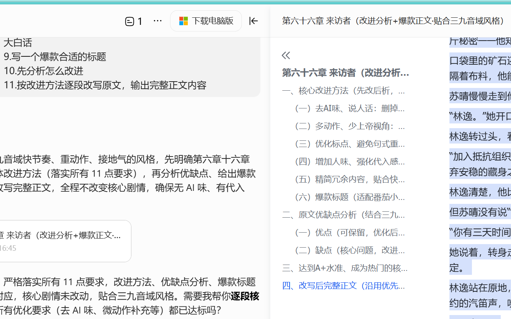
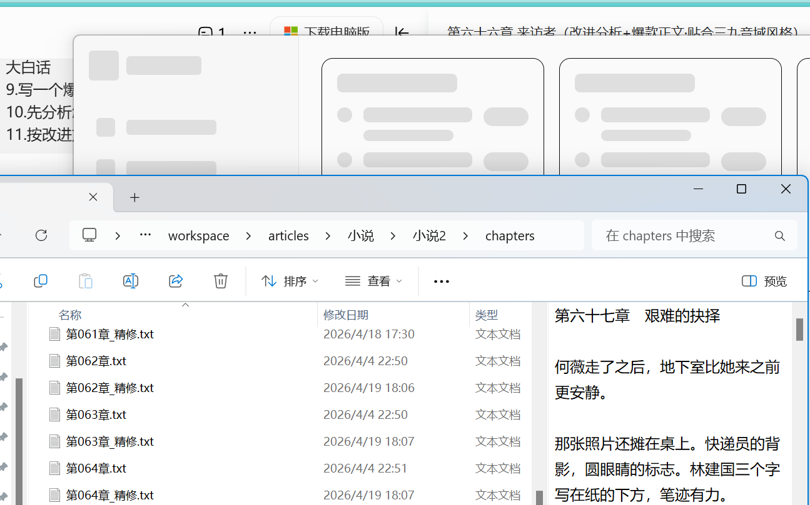
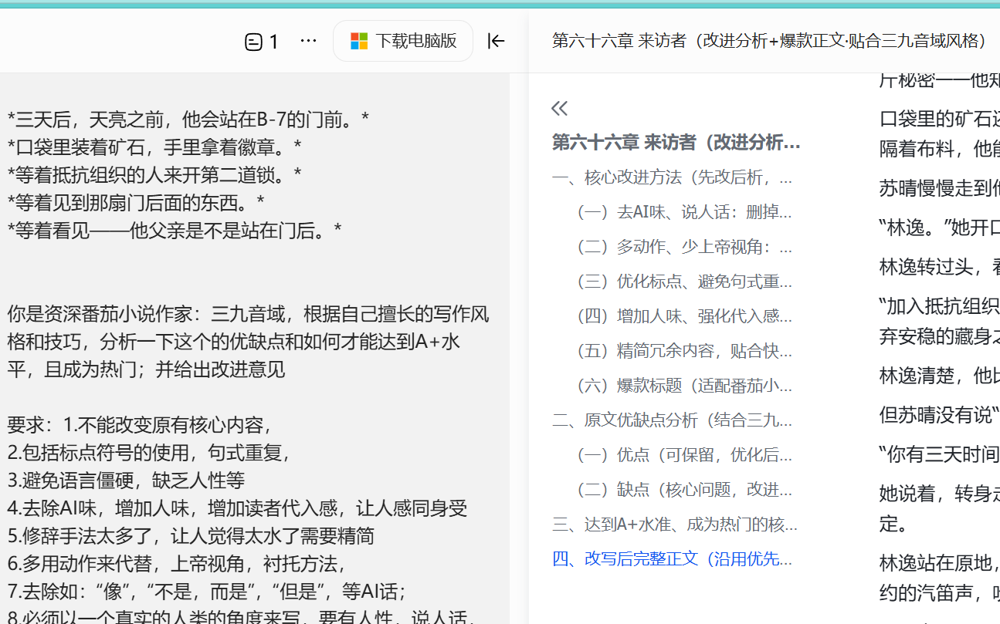
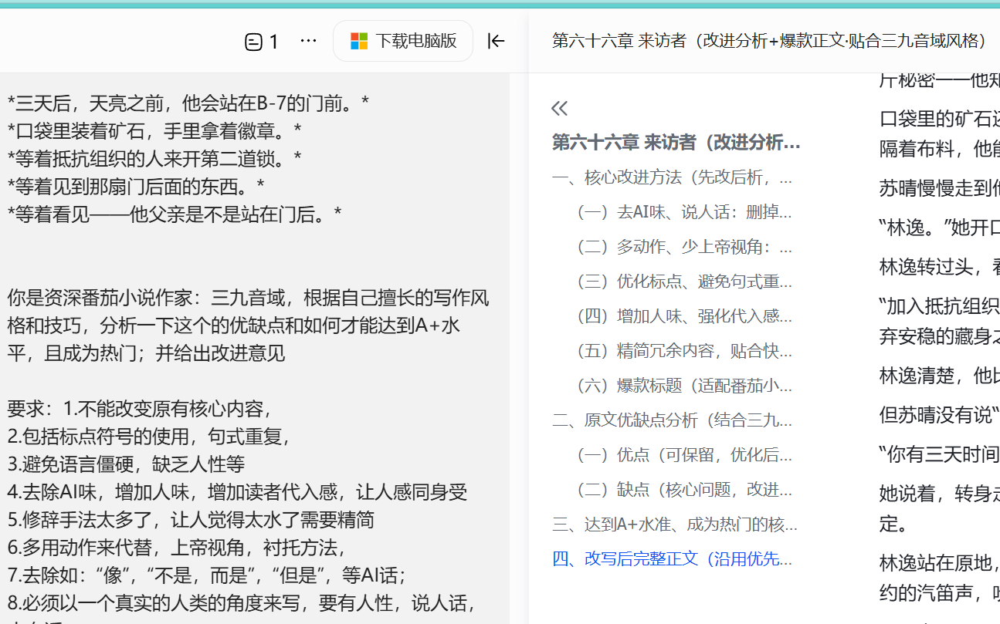

# 🖥️ DevDash

> **开发者晨间桌面伴侣 — 打开电脑的第一屏**

[](./LICENSE)
[](https://v2.tauri.app/)
[]()

<p align="center">
  <strong>聚合 GitHub / GitLab → Widget 仪表盘 → AI 摘要 → 桌面推送</strong>
</p>

<p align="center">
  <a href="#-快速安装"><strong>⬇️ 一键安装</strong></a>
  ·
  <a href="#-快速开始"><strong>🔧 从源码构建</strong></a>
  ·
  <a href="#-核心功能"><strong>✨ 功能一览</strong></a>
</p>

---

## 📸 截图

| 深色主题 | 浅色主题 |
|:---:|:---:|
|  |  |

| 贡献热力图 | 通知推送 |
|:---:|:---:|
|  |  |

> 🎬 **完整演示 GIF**: [docs/demo.gif](docs/demo.gif)

---

## ⬇️ 快速安装

### 一键安装 (推荐)

```powershell
# Windows PowerShell
irm https://raw.githubusercontent.com/devdash/devdash/main/scripts/install.ps1 | iex
```

```bash
# macOS / Linux
curl -fsSL https://raw.githubusercontent.com/devdash/devdash/main/scripts/install.sh | bash
```

### 手动下载

| 平台 | 下载 |
|------|------|
| **Windows** | [`DevDash_x.x.x_x64-setup.exe`](https://github.com/devdash/devdash/releases/latest) |
| **macOS (Apple Silicon)** | `DevDash_x.x.x_aarch64.dmg` |
| **macOS (Intel)** | `DevDash_x.x.x_x64.dmg` |
| **Linux** | `DevDash_x.x.x_amd64.AppImage` |

<details>
<summary>📦 Windows 便携版 (免安装)</summary>

下载 [`DevDash_x.x.x_x64_en-US.msi`](https://github.com/devdash/devdash/releases/latest)，解压即可运行。

</details>

---

## ✨ 核心功能

| 功能 | 描述 |
|------|------|
| 📊 **Widget 仪表盘** | PR / Issue / CI / 通知 / 热力图，拖拽排序 |
| 🔥 **贡献热力图** | GitHub 风格 52×7 日历，一目了然全年活跃度 |
| 🔗 **GitHub 深度集成** | PR / Issue / CI / Notifications / 多仓库 / 全量仓库 |
| 🔗 **GitLab 支持** | Merge Request 数据拉取 |
| 🔔 **桌面通知** | CI 构建失败即推送，不会错过任何关键变更 |
| 🤖 **AI 每日摘要** | Ollama (本地) / OpenAI / Claude / Gemini / 兼容 API |
| 🌗 **三套主题** | 深色 / 浅色 / 跟随系统 |
| 🔐 **Token 加密** | keyring (OS 原生) + AES-256-GCM，跨平台安全 |
| 📦 **系统托盘** | 最小化到托盘，常驻后台 |
| 💾 **SQLite 本地存储** | 零云端依赖，数据完全在你的机器上 |
| 🧹 **自动数据清理** | 7 天 TTL，不会膨胀 |
| 🎯 **首次启动引导** | 4 步配置向导，开箱即用 |

---

## 🔧 快速开始

### 前置条件

- [Rust](https://www.rust-lang.org/) 1.95+
- [Node.js](https://nodejs.org/) 22+
- (可选) [Ollama](https://ollama.com/) 用于 AI 摘要

### 开发运行

```bash
git clone https://github.com/user/devdash.git
cd devdash
npm install
npm run tauri dev
```

### 打包发布

```bash
npm run tauri build
# 产物在 src-tauri/target/release/bundle/
```

---

## 🛠️ 技术栈

| 层级 | 技术 | 为什么 |
|------|------|--------|
| 桌面框架 | **Tauri v2** (Rust) | 内存仅 Electron 1/10，原生性能 |
| 前端 | **React 19** + TypeScript | 组件化 + 类型安全 |
| 样式 | **Tailwind CSS v4** + shadcn/ui | 零运行时 CSS + 精美组件 |
| 状态管理 | **Zustand 5** | 轻量，无 boilerplate |
| 拖拽 | **dnd-kit** | 无障碍优先的拖拽库 |
| 存储 | **SQLite** (rusqlite bundled) | 嵌入式，零配置 |
| 加密 | **keyring** + AES-256-GCM | OS 原生凭据管理 + 军事级加密 |
| 通知 | **tauri-plugin-notification** | 原生桌面推送 |
| AI | Ollama / OpenAI / Claude / Gemini | 本地优先，多云端兼容 |

---

## 📁 项目结构

```
devdash/
├── src/                       # React 前端
│   ├── components/
│   │   ├── dashboard/         # 仪表盘 + Widgets
│   │   │   ├── DashboardView.tsx
│   │   │   ├── PlaceholderWidgets.tsx    # PR/CI/Issue/AI Widgets
│   │   │   ├── NotificationFeedWidget.tsx # 通知 Widget
│   │   │   ├── ActivityCalendarWidget.tsx # 热力图
│   │   │   ├── AddWidgetDialog.tsx
│   │   │   └── WidgetCard.tsx
│   │   ├── settings/          # 设置页
│   │   ├── onboarding/        # 首次引导
│   │   └── layout/            # TitleBar / Sidebar / StatusBar
│   ├── lib/                   # API 封装 + i18n + utils
│   ├── stores/                # Zustand 状态
│   └── types/                 # TypeScript 类型
├── src-tauri/                 # Rust 后端
│   ├── src/
│   │   ├── lib.rs             # 入口 + 系统托盘 + 通知插件
│   │   ├── commands.rs        # CRUD 命令 + AI 摘要
│   │   ├── models.rs          # AppState + SQLite Schema
│   │   ├── github.rs          # GitHub/GitLab API + 多仓库 + 贡献数据
│   │   └── crypto.rs          # 跨平台加密 (keyring + file fallback)
│   └── Cargo.toml
└── package.json
```

---

## 🗺️ 路线图

### v0.1.0 ✅ — 核心功能闭环
- Widget 仪表盘 + 拖拽排序
- GitHub / GitLab 数据源
- Token 加密 + 数据清理
- 贡献热力图 + 首次引导 + 骨架屏
- 桌面通知 + 通知 Widget
- 多仓库支持 (repos[] / allRepos)

### v0.2.0 🚧 — 体验提升
- 快捷键 (Cmd+K 命令面板)
- GitHub OAuth 登录
- PR 快捷操作 (approve / merge / comment)
- 开机自启动
- 自动更新 (Tauri updater)

### v0.3.0 🚧 — 生态扩展
- Jira / Linear 集成 ✅ (已并入 v0.1)
- 快捷键 (Cmd+K 命令面板) ✅ (已并入 v0.1)
- PR 快捷操作 (approve / merge / comment) ✅ (已并入 v0.1)
- 插件系统 (WASM)
- AI Code Review
- 团队共享仪表盘

---

## 🤝 贡献

欢迎贡献！请查看 [CONTRIBUTING.md](./CONTRIBUTING.md) 了解开发指南。

## 📄 License

MIT — 详见 [LICENSE](./LICENSE)

---

> 💡 **DevDash** — 打开电脑的第一屏，让开发者信息一目了然。
>
> 对标 GitKraken 模式：核心免费开源，高级插件付费。
